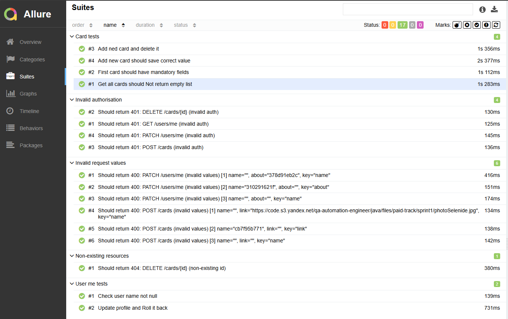
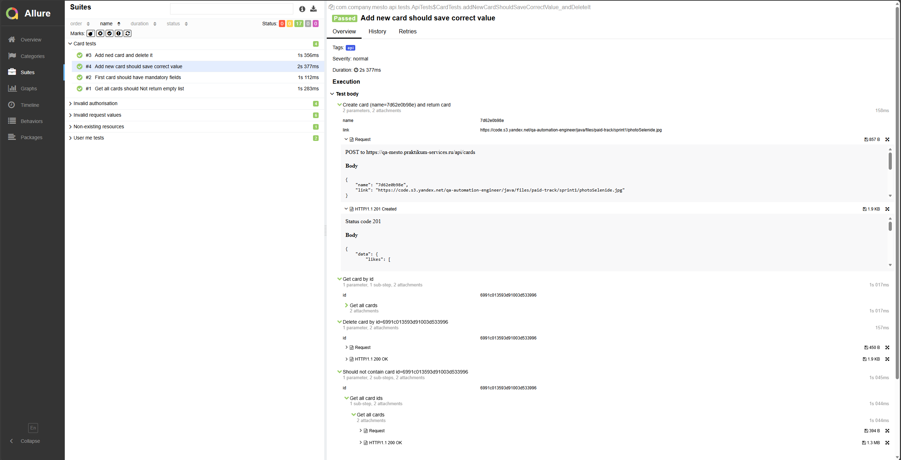

# Mesto UI + API + DB Tests (Java)


Full-stack test automation pet project: **UI (Selenide)** + **API (REST Assured)** + **DB (JDBC/Postgres)** + **Unit (Mockito)** with **Allure** reports and **GitHub Actions** CI.

## TL;DR
- **UI**: Selenide + Page Object Model + Components, stable waits (no `sleep`)
- **API**: REST Assured clients + specs, positive + negative cases
- **DB**: JDBC checks against Postgres (Docker)
- **Unit**: Mockito-based service tests (fast, isolated)
- **Reporting**: Allure (steps + attachments), CI artifacts

---

## Demo (what to check in 60 seconds)
1. Run one suite locally (e.g. API): `mvn clean test -Dgroups=api`
2. Open Allure report: `mvn allure:serve`
3. In CI: open **Actions** → latest run → **Artifacts** → download Allure artifacts

### Allure screenshots
<a href="docs/allure-overview.png"></a>

<a href="docs/allure-test-case.png"></a>

---

## Quickstart (Local)

### Prerequisites
- Java 17+
- Maven 3.9+
- (for DB tests) Docker

### Run suites
```bash
# API
mvn clean test -Dgroups=api

# UI
mvn clean test -Dgroups=ui

# DB
mvn clean test -Dgroups=db

# Unit (Mockito)
mvn clean test -Dgroups=unit
```

---

## Configuration

The project supports overriding settings via **System properties** (`-D...`) or **Environment variables** (ENV).

### Base URL
Priority:
1. System property `baseUrl`
2. ENV `BASE_URL`
3. Default `https://qa-mesto.praktikum-services.ru`

Example:
```bash
mvn clean test -DbaseUrl=https://qa-mesto.praktikum-services.ru
```

### Credentials
Priority:
1. System properties `-DTEST_EMAIL`, `-DTEST_PASSWORD`
2. ENV `TEST_EMAIL`, `TEST_PASSWORD`

Example:
```bash
mvn clean test -DTEST_EMAIL=mail@example.com -DTEST_PASSWORD=12345
```

### DB (for db suite)
System properties:
- `-Ddb.url=...`
- `-Ddb.user=...`
- `-Ddb.pass=...`

Environment variables:
- `DB_URL`
- `DB_USER`
- `DB_PASS`

Defaults:
- `jdbc:postgresql://localhost:5432/mesto`
- user: `mesto`
- pass: `mesto`

---

## Run UI Tests with Remote Selenium (CI / Docker)
```bash
mvn clean test -Dgroups=ui -Dselenide.remote=http://localhost:4444/wd/hub -Dselenide.headless=true
```

---

## DB Tests (JDBC + PostgreSQL)

Start Postgres locally:
```bash
docker compose up -d
```

---

## Run in CI (GitHub Actions)
1. Open repository → **Actions**
2. Choose workflow (`api-test`, `ui-tests`, `db-tests`, `unit-tests`) → **Run workflow**
3. Download artifacts (Allure) from the workflow run

---

## Test suites
- `-Dgroups=ui` — UI tests (Selenide)
- `-Dgroups=api` — API tests (REST Assured)
- `-Dgroups=db` — DB tests (JDBC + Postgres)
- `-Dgroups=unit` — Unit tests (Mockito)

---

## Allure report

### Generate report
```bash
mvn allure:report
```

### Output folders
- Raw results: `target/allure-results/`
- HTML report: `target/site/allure-maven-plugin/`

### Open locally
Open in browser:
- `target/site/allure-maven-plugin/index.html`

Or use:
```bash
mvn allure:serve
```

---

## Project structure (high level)
```text
src/test/java/com/company/mesto/
  ui/   (pages, components, ui tests)
  api/  (clients, models, specs, api tests)
  db/   (jdbc client, queries, db tests)
  unit/ (mockito unit tests)
```

---

## Notes
- Suite selection is done via `-Dgroups=...` (kept intentionally for simplicity)
- Keep secrets out of the repo (use ENV / GitHub Secrets)
